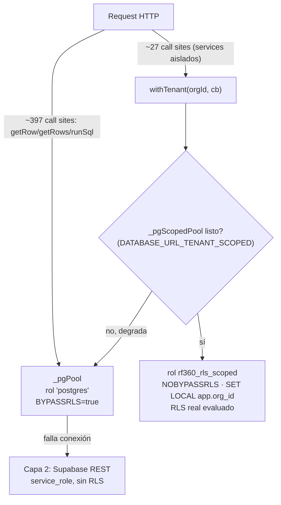

# AI_ARCHITECTURE_CONTEXT.md — RadFor-360 (RadarFondos 360)

> Cerebro denso para agentes de IA. Cada afirmación está anclada a `archivo:línea` real (escaneado 2026-09-05). Cero relleno. Si un dato de este doc y el código real chocan, **el código gana** — re-verificar antes de actuar (protocolo del repo, ver `CLAUDE.md`).

---

## 0. Corrección de premisas (antes de leer el resto)

Este doc fue encargado asumiendo un dominio regulatorio que **no existe en este código**: no hay motores "MGA", "POT" ni "Decreto 1077" — cero coincidencias en `backend/`. Lo que sí existe, verificado por lectura directa:

| Asumido | Realidad verificada |
|---|---|
| Motor MGA/POT/Decreto 1077 | No existe. El dominio real es: convocatorias de financiación (radar) + formulación de proyectos (APU/AIU/IVA, DIAN) |
| — | `backend/pipeline/apuEngine.js` — Análisis de Precios Unitarios, IVA vía Decreto 1372/1992 y Art. 447 E.T. |
| — | `backend/services/ValorExponencialService.js` — SROI + mapeo ODS, SMMLV Decretos 1469/1470 de 2025 |
| — | `backend/services/EstresadoFinancieroService.js` — simulador de estrés macroeconómico (umbral 15%) |
| — | `backend/services/AuditorForenseService.js` — motor VERIFICAR del ciclo PHVA (coherencia HSEQ/aritmética) |
| Husky pre-commit corre React Doctor | Falso. `.husky/pre-commit` corre solo: bloqueo de secretos + `architecture-gate.cjs`. React Doctor corre vía GitHub Actions (`react-doctor.yml`), **advisory-only**, no bloquea nada hoy |
| Render `autoDeploy: false` | Confirmado en `render.yaml:15`, pero el comentario dentro de `.github/workflows/radar.yml:64-67` describe la config VIEJA (`autoDeploy=yes`) — el workflow no se actualizó tras el fix del 2026-09-05. Doc drift real, ver §6 |

Este documento describe lo real, con las 6 secciones pedidas retituladas al dominio verdadero.

---

## 1. FILOSOFÍA CENTRAL

**Paradigma dominante (inferido del código, sin nombre propio en el repo): matemática determinista primero, LLM solo donde el cálculo no alcanza.**

- Todo lo que es aritmética de negocio vive en JS puro, sin LLM en el camino crítico:
  - `apuEngine.js` — costeo de obra (mano de obra + materiales + equipos + AIU + IVA), 100% fórmulas.
  - `matchScore.js:21-22` — `S_match = w1·cos(θ) + w2·P_norm − w3·C_risk` (pesos fijos `{cosine:0.50, prob:0.30, risk:0.20}`), coseno vía pgvector o fallback JS.
  - `EstresadoFinancieroService.js` — clasificación VIABLE/EN RIESGO/CRITICO por umbral fijo (15%/7.5%), cero IA.
  - `ValorExponencialService.js` — SROI = inversión × `ratioConversion` **explícito del usuario** (comentario línea 6-8: "inventar un multiplicador aquí sería una alucinación financiera" — rechazo consciente de que el LLM invente el ratio).
  - `AuditorForenseService.js` — hallazgos de coherencia (descuadres aritméticos, ausencia HSEQ) por regla, no por juicio de modelo.
- El LLM (Gemini, vía `@google/generative-ai`) entra solo donde el problema es de lenguaje/heurística, nunca de aritmética: `EntradaIAService.js` (fusión de contexto), `viabilidadAgent.js`, `arbolObjetivosAgent.js`, `enfoqueEntidadAgent.js`, `sectorClassifier.js`, `CopilotoService.js`. Todos con circuit breaker propio (`geminiCircuitBreaker.js`, persistido — sobrevive reinicios PM2, commit `55ab69b`).
- **Regla dura observada, no documentada previamente**: cuando un cálculo requiere un supuesto de negocio sin fuente verificable (ratio SROI), el código **rechaza explícitamente un default** y exige el dato al usuario (`ValorExponencialService.js:57-61`) en vez de dejar que un LLM lo estime.
- Fuente normativa real usada en el código (no MGA/POT): Decreto 1372/1992 y DUR 1625/2016 Art. 1.3.1.7.9 (IVA AIU construcción), Art. 447 E.T. (IVA consultoría/ventas), Decretos 1469/1470 de 2025 (SMMLV 2026 = $1.750.905 COP, hardcoded en `ValorExponencialService.js:26` con nota de "actualizar cuando cambie el año").

---

## 2. TOPOLOGÍA MULTI-TENANT Y DATOS

**Patrón real: monolito modular Express + Postgres/Supabase, NO hexagonal, NO DDD con capas explícitas.** `backend/routes/*.js` mezcla HTTP + lógica de negocio directamente; `backend/services/*.js` y `backend/pipeline/*.js` son la única separación de "dominio" real, y es parcial (no hay capa de interfaces/puertos).

### 2.1 Doble pool de conexiones (`backend/config/database.config.js`)



- **Pool principal** (`_pgPool`, `DATABASE_URL`): rol `postgres`, `rolbypassrls=true` **verificado en vivo** (`053_rls_scoped_role.sql:8-9`, query real ejecutada contra la BD). Sirve **264 call sites en `server.js` + ~133 en `backend/routes/*.js`** (inventario exacto en `docs/ROADMAP_MIGRACION_TENANT_2026.md` §1) — protegidos únicamente por `WHERE org_id = ?` manual, **no por RLS**.
- **Pool RLS-escopado** (`_pgScopedPool`, `DATABASE_URL_TENANT_SCOPED`, migración `053_rls_scoped_role.sql`): rol `rf360_rls_scoped`, `NOBYPASSRLS`, `NOSUPERUSER`, GRANT DML mínimo sobre **7 tablas**: `proyectos, project_apu_lineas, project_hallazgos, project_escenarios_estres, project_sroi_metrics, project_ods_mapping, project_chat_history`. Usado por `withTenant()` (`database.config.js:497-543`), que hace `BEGIN; SELECT set_config('app.org_id', $1, TRUE); <callback>; COMMIT`.
- **Degradación explícita y logueada** si `DATABASE_URL_TENANT_SCOPED` falta o no conecta: `withTenant()` cae al pool principal (BYPASSRLS) con warning (`database.config.js:512-513`) — nunca falla silenciosamente, pero tampoco aplica RLS real en ese caso.
- **Capa 2 (fallback total)**: si `_pgPool` no conecta, todo el tráfico (incluido `withTenant()` en modo REST) pasa por Supabase PostgREST con `SUPABASE_SERVICE_KEY` (bypassa RLS por diseño de Supabase) — traductor SQL→REST hecho a mano (`restSelect/restInsert/restUpdate/restDelete`, `database.config.js:229-484`). Limitación dura conocida: `restUpdate()` **lanza error explícito** si el SQL usa `jsonb_set()` (línea 452-461) — no hay soporte real de escritura JSON parcial en Capa 2.
- **RLS en Supabase**: políticas `tenant_isolation` en `026_rls_policies_tenant_isolation.sql`, ampliadas en `054_rls_raci_gemini_trial.sql` (5 tablas más: `raci_*`, `gemini_key_state`, `trial_sessions` — estas 2 últimas **excluidas** a propósito de `withTenant()` porque son estado global/anónimo sin columna de tenant, no candidatas al patrón).
- **SPOF real**: `server.js` (264 call sites) es el mayor punto de riesgo de aislamiento cross-tenant — depende 100% de que cada ruta recuerde el `WHERE org_id`. Ninguna prueba automatizada cubre esto hoy fuera de `test:smoke`/`test:security` (13 tests totales para ~397 call sites, ver §6).
- **Estado**: en progreso, NO completo. Migración planificada en 5 fases en `docs/ROADMAP_MIGRACION_TENANT_2026.md` (Fase 5 = `server.js`, dejado para el final a propósito, "romper producción sin cobertura suficiente" es el riesgo que se evita).

---

## 3. NÚCLEO FINANCIERO Y NORMATIVO

(Ver corrección de premisas §0 — no hay MGA/POT/OXI/Decreto 1077.)

| Motor | Archivo | Qué calcula | Aislamiento LLM |
|---|---|---|---|
| APU | `backend/pipeline/apuEngine.js` | Costo directo (mano obra+materiales+equipos) + AIU 3 componentes (Admin/Imprevistos/Utilidad, default 20/3/5) + IVA por tipo de contrato | 100% JS, cero llamada a modelo |
| Estresado Financiero | `backend/services/EstresadoFinancieroService.js` | Simulación de choque macro sobre presupuesto real (`project_apu_lineas`); clasifica VIABLE / EN RIESGO (≥7.5%) / CRITICO (≥15%) | Reporte determinístico redactado por plantilla (línea 9-12: "no es una narrativa generada por un modelo de IA") |
| Valor Exponencial (SROI+ODS) | `backend/services/ValorExponencialService.js` | SROI = inversión × ratio (obligatorio, del usuario); empleos-persona-mes = costo mano obra / SMMLV 2026; mapeo ODS por regex de palabras clave (6/8/9/11) | Heurística por regex, no LLM; explícitamente etiquetado "no es certificación oficial" |
| Auditor Forense | `backend/services/AuditorForenseService.js` | Motor VERIFICAR del PHVA: ausencia total de presupuesto HSEQ (EPP/SST/SEÑALIZACION), descuadres aritméticos por fila (tolerancia $50 COP) | Reglas fijas; comentario explícito: "alertas técnicas de coherencia, nunca dictámenes legales" |
| Match Score | `backend/pipeline/matchScore.js` | `S_match` ponderado (coseno embeddings 0.50 + probabilidad 0.30 − riesgo 0.20); riesgo compuesto por proximidad de deadline + desajuste presupuestal | Embeddings vía Gemini `text-embedding-004` (768 dims) para el vector; el score en sí es álgebra pura |
| Scoring Dinámico | `backend/services/scoringDinamico.js` | (no auditado en detalle en este pase — mismo patrón de servicio aislado, ver §5 para ampliar) | — |

**Por qué aislados de los LLMs (patrón consistente en los 4 archivos con docstring explícito)**: un LLM no tiene autoridad para inventar una tarifa de IVA, un ratio SROI o un umbral de viabilidad — esos son hechos normativos o decisiones de negocio verificables. El LLM se usa río arriba (extracción/clasificación de texto) o río abajo (redacción de observaciones a partir de un número ya calculado), nunca en el cálculo mismo.

**Corrección de contrato Capa 2 (hallazgo real, `database.config.js:452-461`)**: 3 de estos 4 motores escriben con `jsonb_set()` (viabilidad-financiera, ficha-tecnica-merge, invalidación de anexos). Si el sistema está en Capa 2 (REST, pool principal caído), esas escrituras **fallan explícitamente** en vez de mentir con un 200 OK vacío — fix de un bug real donde antes se perdía el dato en silencio.

---

## 4. ESTADO DE LA SEGURIDAD Y AUTH

### 4.1 `client/src/lib/authStorage.ts` — módulo centralizado (nuevo, 2026-09-05)

Punto único de lectura/escritura de sesión en `localStorage`, creado para resolver un hallazgo de React Doctor (`client-localstorage-no-version`): **7 lectores/escritores directos e independientes** existían antes (`AuthContextNew.tsx`, `apiClient.ts`, `services/api.ts`, `main.tsx`, `SubscriptionContext.tsx`, `FavoritosContext.tsx`, `Dashboard.tsx`), ninguno vía props/contexto React.

- Claves nuevas versionadas: `auth_token:v1`, `auth_user:v1`. Claves legadas: `auth_token`, `auth_user`.
- **Migración de un solo sentido al leer** (`leerConMigracion`, líneas 26-35): si la clave nueva está vacía, lee la vieja, la copia a la nueva, borra la vieja. Nunca un rename ciego — evita deslogueo de sesiones reales ya activas en producción.
- `borrarAuthSession()` limpia las **4 claves físicas** (nueva+legada × token+user) — un residuo legado no puede resucitar una sesión cerrada.
- `esEventoDeSesion()` compara contra ambas claves para sincronización entre pestañas durante la transición (un tab con bundle viejo aún escribe la clave legada).
- **Cero dependencias** (ni React, ni `apiClient.ts`) — diseño verificado explícitamente por el agente `architect` (id `aa4b3d6892a0d41dd`, 2026-09-05) para descartar import circular contra los 7 consumidores.
- **Manejo del "token transicional"**: `demo-mode-token` (`auth.middleware.js:58-60`) — aceptado solo si `NODE_ENV !== 'production'`, mapea a un UUID fijo reconocible (`00000000-0000-0000-0000-000000000001`, todo ceros salvo el último dígito) sembrado en `015_seed_dev_user.sql`. Motivo del UUID real (no `'dev-user-001'`): `proyectos.user_id`/`org_id` son columnas UUID con FK — un valor no-UUID rompería cualquier INSERT autenticado con 500.

### 4.2 RBAC — perímetro real

- `authenticateToken` (`backend/middlewares/auth.middleware.js:45-`) exige `Authorization: Bearer <jwt>`, rechaza sin log de motivo (`logAuthRejection`).
- `requireAdmin` (línea 97-100): `if (req.userRole !== 'admin') return 403`. Un solo rol (`admin`) — no hay jerarquía de roles más allá de eso en este archivo.
- Rutas que usan `requireAdmin`, verificado por grep: `compliance.routes.js`, `scraper.routes.js`, `subscriptions.routes.js`.
- **Middlewares de seguridad activos**: `SecurityMiddleware.js` (rate limiters: `authLimiter`, `trialLimiter`, `aiLimiter`, `entradaCampoLimiter`, `financialPipelineLimiter`, `slowDown`), `tokenBlacklist.js` (revocación de tokens + `checkAccountStatus`), `byokGate.js` (`requireByokOrExento` — gate de BYOK de llaves Gemini), `radarCache.js`.
- **Hallazgo histórico ya corregido** (commit `39a5897`): `GET /api/radar/buscar` estaba sin auth ni rate-limit — alias no protegido de `/api/ia/busqueda-semantica`. Cerrado.
- **Gap conocido y documentado, no un bypass activo**: 397 call sites de acceso a datos dependen de `WHERE org_id = ?` manual en vez de RLS (ver §2) — es un patrón de aislamiento más débil que RLS real, pero no una ruta pública sin auth.

---

## 5. PIPELINE CI/CD Y HARNESSING

### 5.1 Despliegue (`render.yaml`)

- Servicio único Render, `plan: starter` (disco persistente 1GB para fallback SQLite si falta `DATABASE_URL`).
- `startCommand: node server.js`, sirve API + build estático del frontend (`express.static`) — **un solo despliegue**, no Render+Railway (`.env.railway` es huérfano, sin referencias en código).
- `autoDeploy: false` **a propósito**, cambiado el 2026-09-05 (comentario inline `render.yaml:9-14`): con `true`, Render desplegaba en cuanto detectaba el push, sin esperar el job `ci` — el gate `needs: ci` en `radar.yml` era cosmético, código roto llegaba a producción antes de que CI terminara de fallar.
- **Doc drift real detectado en este escaneo**: `.github/workflows/radar.yml:64-67` sigue comentando "el servicio ya tiene `autoDeploy=yes` en Render" — descripción vieja, contradice `render.yaml:15`. El comportamiento real hoy es correcto (deploy gateado por CI vía API de Render), pero el comentario del workflow no se actualizó. **Corregir ese comentario** es deuda de housekeeping, no de funcionalidad.

### 5.2 Pipeline real (`.github/workflows/radar.yml`, "V9.0")

```
push a main / cron cada 6h / workflow_dispatch
  └─ ci (tsc --noEmit + vite build)          ← bloqueante
       └─ deploy (POST a Render API)          ← needs: ci
            └─ smoke-test (poll /api/health, hasta 120s, luego smokeTest.js)  ← needs: deploy
  └─ backup-s3 (solo en cron schedule, no en push)
```

### 5.3 Playwright E2E (`playwright.yml` + `playwright.config.ts`)

- Corre en push/PR a `main` (confirmado, **no** contra un ambiente de staging separado).
- `fullyParallel: false`, `workers: 1` **a propósito** (`playwright.config.ts:7-13`): con 4 workers concurrentes, la contención real (varios Chromium + backend single-thread) disparaba el bloqueo de cuenta de 5 intentos fallidos (`ACCOUNT_LOCKED`) — reproducido y confirmado, la misma suite pasa limpia con `--workers=1`.
- `webServer` levanta backend (`dev:backend`) + frontend (`dev:frontend`) con `reuseExistingServer: !CI`.
- CI genera un `.env` mínimo (`DATABASE_URL`, `JWT_SECRET`, `ENCRYPTION_KEY`) — todo lo demás (Stripe/Wompi/Sentry/PostHog/Resend/Gemini) queda en modo standby sin bloquear, mismo comportamiento que local.

### 5.4 Husky + gate de arquitectura (**no** React Doctor — corrección de premisa)

`.husky/pre-commit` ejecuta, en orden:
1. Bloqueo de archivos de secretos staged (`.env*` salvo `.env.example`, `claves_privadas.txt`, `.mcp.json`) — instalado tras incidente real de `.env` commiteado en repo público (mayo 2026).
2. Bloqueo de patrones de API key reales en el diff (`github_pat_`, `ghp_`, `xkeysib-`, `sb_secret_`, `rnd_`, `sk-`, etc.).
3. `scripts/architecture-gate.cjs --check-gate` — gate "cero código sin diseño aprobado" que llama a la API de Anthropic (modelo `claude-sonnet-4-6`, fetch nativo, sin SDK) para verificar que hay una aprobación de arquitectura vigente para el hash actual de `backend/` + `client/src/`. **Degradación segura**: sin `ANTHROPIC_API_KEY`, informa y NO bloquea (mismo patrón standby que Stripe/Wompi/Sentry).

**React Doctor real**: corre vía GitHub Actions (`react-doctor.yml`), en `pull_request` y `push a main`, **modo advisory** (`blocking` no configurado = `"none"` por default, bloque de gate comentado en el YAML) — postea comentario sticky + commit status con score, pero no falla el check. `npm run doctor` (`package.json:28`) es invocación manual (`npx react-doctor@latest`), no parte de ningún hook.

### 5.5 Observabilidad

- Sentry backend (`backend/config/sentry.config.js`): no-op si falta `SENTRY_DSN`, `tracesSampleRate: 0.1`. Inicializado explícitamente en `server.js:78-79` **después** de `loadEnv()` (import dinámico a propósito — un import estático se evaluaría antes de que `.env` cargue).
- Conectado a 9 archivos de rutas que antes solo usaban `console.error` (commit `f678deb`).
- PostHog frontend: `client/src/lib/posthog.ts`, gateado por `VITE_POSTHOG_KEY` — mismo patrón standby.

---

## 6. DEUDA TÉCNICA Y MAPA DE RUTA

Fuente primaria: `docs/ROADMAP_MIGRACION_TENANT_2026.md` (fechado 2026-09-04/05, inventario declarado "verificado, no estimado") + hallazgos propios de este escaneo.

### 6.1 Deuda de aislamiento multi-tenant (la más grande, cuantificada)

**~370 call sites sin migrar a `withTenant()`** (397 totales − 27 ya cubiertos). Distribución real:

| Archivo | Call sites | Estado |
|---|---:|---|
| `server.js` | 264 | Sin migrar — dejado para el final a propósito (Fase 5) |
| `anexos.routes.js` | 26 | Parcialmente migrado |
| `biblioteca.routes.js` | 20 | Sin migrar |
| `proyectos.routes.js` | 19 | Parcialmente migrado |
| `fichaTecnica.routes.js` | 10 | Sin migrar |
| `compliance.routes.js` | 9 | Sin migrar |
| `marcoNormativo.routes.js` | 8 | Sin migrar |
| `subscriptions.routes.js` | 7 | Sin migrar — **riesgo alto**, requiere ventana de mantenimiento |
| `presupuesto.routes.js` / `configLogistica.routes.js` | 6 c/u | Sin migrar |
| `radicacion.routes.js` / `motorDialectico.routes.js` / `exportacion.routes.js` / `authGoogle.controller.js` | 5 c/u | Sin migrar |
| `reporte.routes.js` | 4 | Sin migrar |
| `wompi.webhook.js` / `stripe.webhook.js` | 2 c/u | Sin migrar — pagos, tratar con reconciliación manual 24-48h post-migración |

**Cobertura de test actual: 13 tests (`test:smoke` 8 + `test:security` 5) para ~397 call sites** — declarado insuficiente para migrar con confianza; Fase 0 del roadmap es ampliarla antes de tocar código.

**Bloqueador de Fase 0 (confirmado en vivo, no hipótesis)**: `server.js` no arranca en frío con `node server.js` sin wrapper — `database.config.js`/`supabase.config.js` leen `SUPABASE_SERVICE_KEY` a nivel de módulo, y ese import ocurre antes de que `loadEnv()` corra en el cuerpo de `server.js`. Sin arreglar esto, ningún test que dependa de un server vivo es confiable fuera de un entorno que precargue `.env` por otro medio.

**Orden de migración (por riesgo, no por tamaño)**: Fase 1 (`anexos`+`proyectos`, patrón ya probado) → Fase 2 (lecturas/reportes, bajo impacto) → Fase 3 (escritura de negocio) → Fase 4 (pagos, ventana de mantenimiento) → Fase 5 (`server.js`, subdividido por bloque funcional: auth/proyectos/radar/IA).

### 6.2 Housekeeping menor (encontrado en este escaneo, no en el roadmap)

- Comentario desactualizado en `.github/workflows/radar.yml:64-67` sobre `autoDeploy` (ver §5.1) — corregir el texto, cero impacto funcional.
- `scoringDinamico.js` no fue auditado en profundidad en este pase (mismo patrón de servicio aislado observado en los otros 4 motores financieros, no verificado línea por línea).

### 6.3 Rendimiento y accesibilidad (JS puro y CSS) — **sin profiling real, no aplicar a ciegas**

No se encontró en el código ningún hallazgo de performance/accesibilidad con evidencia de medición real (Lighthouse, profiler, bundle analyzer) en este escaneo. React Doctor (`react-doctor.yml`) es la única herramienta configurada que cubre bundle-size/accesibilidad, pero corre en modo advisory — sus hallazgos viven en comentarios de PR, no en este repo como issues persistentes. **Antes de aplicar cualquier optimización de este tipo**: correr React Doctor con `scope: full` o Lighthouse contra el build real y citar el número (siguiendo el protocolo de auditoría verificada del `CLAUDE.md` de este repo — "debería ser más rápido" no es un hallazgo válido, un profile real sí).

### 6.4 Deuda de negocio ya documentada y verificada en sesiones previas (memoria, re-confirmar antes de asumir vigente)

- Pagos: módulo Stripe/Wompi completo pero con llaves vacías (standby deliberado) — falta decisión de negocio sobre montos COP y proveedor definitivo.
- 51/51 tablas de `public` con `owner = postgres` (verificado en `053_rls_scoped_role.sql:18`) — cualquier tabla nueva hereda el mismo problema de RLS-sin-enforcement hasta que se agregue explícitamente al pool escopado.

---

## Apéndice — mapa de archivos citados en este documento

`backend/config/database.config.js` · `backend/db.js` · `backend/middlewares/auth.middleware.js` · `client/src/lib/authStorage.ts` · `backend/pipeline/apuEngine.js` · `backend/services/{ValorExponencialService,EstresadoFinancieroService,AuditorForenseService,scoringDinamico}.js` · `backend/pipeline/matchScore.js` · `render.yaml` · `.github/workflows/{radar,playwright,react-doctor}.yml` · `.husky/pre-commit` · `scripts/architecture-gate.cjs` · `docs/ROADMAP_MIGRACION_TENANT_2026.md` · `backend/migrations/{026,053,054}_*.sql`
